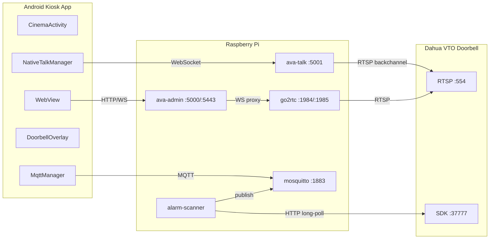
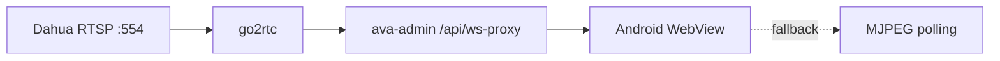
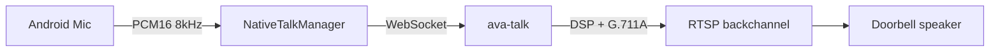
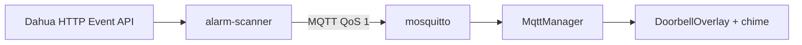

# AVA Doorbell v4

[](https://github.com/superfeldy/ava-doorbell/releases)
[](LICENSE)
[](https://www.raspberrypi.com/)
[](android-app/)

A full-stack doorbell and camera monitoring system for Raspberry Pi. Streams Dahua VTO doorbell and IP camera feeds to an Android kiosk app via WebRTC/MSE/MJPEG, with two-way audio, ring notifications, and a web-based admin dashboard.

## Architecture



### Services

| Service | Port | Description |
|---------|------|-------------|
| `ava-admin` | 5000 (HTTP) / 5443 (HTTPS) | FastAPI dashboard, API, go2rtc WebSocket proxy |
| `ava-talk` | 5001 (WS/WSS) | Mic audio relay → doorbell RTSP backchannel |
| `alarm-scanner` | — | Polls Dahua event API → publishes to MQTT |
| `go2rtc` | 1984 / 1985 | Camera stream server (WebRTC, MSE, RTSP) |
| `mosquitto` | 1883 | MQTT broker for ring/event/status messages |

### Video Pipeline



### Audio Pipeline (Two-Way Talk)



> ava-talk DSP chain: smoothing → noise gate → AGC → soft limiter → G.711A encode

### Event Pipeline



## Project Structure

```
ava-doorbell-v4/
├── android-app/                    # Android kiosk app (Kotlin)
│   └── app/src/main/java/com/doorbell/ava/
│       ├── CinemaActivity.kt       # Main activity — WebView, MJPEG fallback, MediaTek detect
│       ├── ConfigActivity.kt       # Settings screen
│       ├── DoorbellOverlayService.kt # Floating ring popup
│       ├── IdleManager.kt          # Screen timeout / dim management
│       ├── MqttManager.kt          # MQTT client with auto-reconnect
│       ├── NativeTalkManager.kt    # Mic → WebSocket (bypasses WebView getUserMedia)
│       └── SettingsManager.kt      # EncryptedSharedPreferences for API token
├── services/
│   ├── talk_relay.py               # WebSocket → RTSP backchannel audio relay
│   ├── alarm_scanner.py            # Dahua event poller → MQTT publisher
│   ├── requirements.txt            # Python dependencies
│   └── admin/                      # FastAPI admin dashboard
│       ├── main.py                 # App entry, routers, middleware
│       ├── config.py               # Atomic config read/write with in-memory cache
│       ├── auth.py                 # Session + API token authentication
│       ├── routers/                # API route modules
│       │   ├── cameras.py          # Camera CRUD, discovery, layouts
│       │   ├── services.py         # Service status, restart, logs
│       │   ├── settings.py         # Config management (protected keys)
│       │   ├── websocket.py        # go2rtc WebSocket proxy
│       │   ├── setup.py            # First-run setup wizard
│       │   └── ...
│       ├── static/                 # Frontend assets
│       │   ├── js/multiview/       # Camera grid — WebRTC, MSE, MJPEG players
│       │   ├── js/admin/           # Dashboard UI
│       │   └── css/
│       └── templates/              # Jinja2 HTML templates
├── config/
│   └── config.default.json         # Default configuration template
├── install.sh                      # Full Pi installation script
├── setup.sh                        # Interactive setup wizard (CLI)
├── burn_in.sh                      # Automated stress/soak test
├── integration_test.sh             # End-to-end integration test suite
└── SETUP.md                        # Technician installation guide
```

## Requirements

### Raspberry Pi
- Raspberry Pi 4 or 5 (tested on Pi 4B 4GB)
- Raspberry Pi OS (Bookworm)
- Network access to Dahua VTO doorbell

### Android Device
- Android 7.0+ (API 24)
- Network access to Pi
- Recommended: dedicated tablet in kiosk mode

### Doorbell
- Dahua VTO series (tested with DINGER-PRO-2 / IPC-DB6I)
- RTSP enabled, HTTP event API accessible

## Installation

### Quick Start

```bash
# On the Pi — clone and run interactive setup
git clone https://github.com/superfeldy/ava-doorbell.git
cd ava-doorbell
./setup.sh
```

The setup script will:
1. Install dependencies (mosquitto, go2rtc, Python venv, samba)
2. Create systemd services (auto-start on boot)
3. Prompt for doorbell IP, credentials, admin password
4. Verify all services and connectivity
5. Print the dashboard URL and Android app settings

### Manual Install

```bash
./install.sh              # Install packages and services
# Then open http://<PI_IP>:5000/setup in a browser
```

See [SETUP.md](SETUP.md) for the full technician guide.

### Android App

Build from source:
```bash
cd android-app
./gradlew assembleDebug
# APK at app/build/outputs/apk/debug/app-debug.apk
```

Or download from the admin dashboard at `http://<PI_IP>:5000/app/download`.

## Configuration

Configuration is stored in `config/config.json` on the Pi. Key sections:

| Section | What it controls |
|---------|-----------------|
| `server` | Ports (admin 5000, go2rtc 1984, talk 5001, MQTT 1883) |
| `doorbell` | Dahua VTO IP, credentials, RTSP port, monitored events |
| `nvr` | NVR IP, credentials, channel count |
| `cameras` | Camera stream definitions (name, URL, type) |
| `layouts` | Multi-view grid presets (single, 2-up, 4-up, etc.) |
| `notifications` | MQTT topics, ring cooldown (default 10s) |
| `smb` | Samba file shares (config, services, recordings) |

Protected keys (`admin`, `version`, `setup_complete`) cannot be modified via the API.

## MQTT Topics

| Topic | QoS | Payload | Description |
|-------|-----|---------|-------------|
| `doorbell/ring` | 1 | JSON event + timestamp | Ring button press (cooldown-throttled) |
| `doorbell/event` | 0 | JSON event + timestamp | All doorbell events |
| `doorbell/status` | 1 (retained) | `"online"` / `"offline"` | Alarm scanner health |

## Talk Relay Wire Format

Binary WebSocket frames to `ws://<PI_IP>:5001`:

| Byte 0 | Format | Description |
|--------|--------|-------------|
| `0x01` | PCM16 LE | Raw 8kHz 16-bit samples (Android NativeTalkManager) |
| `0x03` | G.711A | Pre-encoded A-law (browser talk.js) |

Chunk size: 320 samples = 640 bytes PCM16 = 40ms at 8kHz.

The relay applies smoothing, noise gate, AGC, and soft limiting before encoding to G.711A and sending via RTSP backchannel to the doorbell speaker.

## MediaTek Compatibility

Devices with MediaTek chipsets have known WebView multiprocess issues (`cr_ChildProcessConn` errors). The app auto-detects MediaTek hardware and:
- Skips WebView entirely
- Forces MJPEG-only single-camera mode
- Blocks multi-view layouts
- Uses faster stall detection (8s) and polling (150ms)

## Development

```bash
# Build Android app
cd android-app && ./gradlew assembleDebug

# Syntax-check Python services
python3 -m py_compile services/talk_relay.py
python3 -m py_compile services/alarm_scanner.py
python3 -m py_compile services/admin/main.py

# Run integration tests (requires Pi + doorbell on network)
./integration_test.sh

# Run burn-in soak test
./burn_in.sh
```

## Tech Stack

| Layer | Technology |
|-------|-----------|
| Android | Kotlin, AndroidX, Material 3, Media3 ExoPlayer, Paho MQTT, OkHttp |
| Pi Backend | Python 3, FastAPI, uvicorn, websockets, paho-mqtt |
| Streaming | go2rtc (WebRTC, MSE, RTSP proxy) |
| Messaging | Mosquitto (MQTT) |
| Frontend | Vanilla JS, Jinja2 templates |
| Security | EncryptedSharedPreferences (Android), session signing, API tokens, digest auth |
